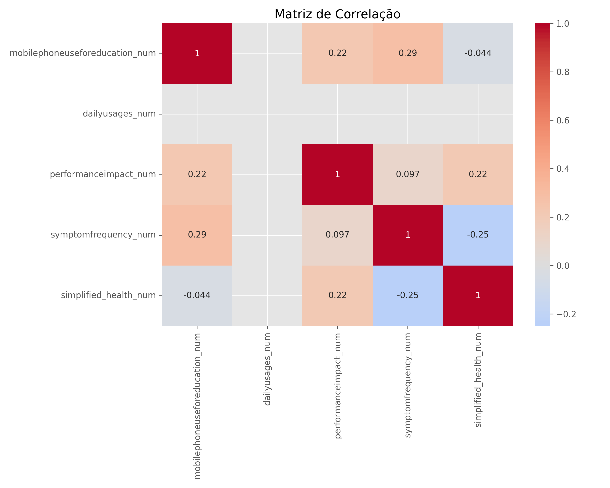

# 📱 Saúde Celular - Impacto do Uso de Celulares na Educação e Saúde



Este projeto é um painel interativo desenvolvido com **Shiny para Python**, que analisa o impacto do uso de dispositivos móveis na saúde e educação de estudantes. A aplicação apresenta visualizações detalhadas sobre hábitos de uso, sintomas relatados e correlações entre uso de dispositivos e bem-estar.

## 📊 Principais Funcionalidades

- Análise demográfica dos usuários por gênero e faixa etária
- Padrões de uso de dispositivos móveis para educação
- Sintomas relatados associados ao uso prolongado
- Correlações entre tempo de uso, impacto no desempenho e saúde
- Visualizações interativas com filtros dinâmicos

## 🔧 Tecnologias Utilizadas

- **Python** - Linguagem principal
- **Shiny & ShinyWidgets** - Framework de dashboard interativo
- **Pandas** - Manipulação e análise de dados
- **Plotly** - Visualizações interativas
- **Jupyter Notebook** - Análise exploratória inicial

## 🚀 Como Executar

### Requisitos

- Python 3.7+
- Dependências listadas em `requirements.txt`

### Instruções

1. Clone este repositório
```bash
git clone https://github.com/Rebelo81/SaudeCelular.git
cd SaudeCelular
```

2. Instale as dependências
```bash
pip install -r requirements.txt
```

3. Execute a aplicação Shiny
```bash
shiny run --reload app.py
```

4. Acesse a aplicação no navegador (geralmente em http://localhost:8000)

## 📁 Estrutura do Projeto

- `app.py` - Aplicação Shiny principal
- `saudevscelular.py` - Script de processamento de dados
- `saudevscelular.csv` - Dados principais
- `dados_uso_celular_limpos.csv` - Dados processados
- `SaudeVsMiniTelas.ipynb` - Notebook com análise exploratória
- `plots/` - Diretório com gráficos gerados

## 📊 Fonte dos Dados

Os dados utilizados neste projeto foram obtidos do [Kaggle](https://www.kaggle.com/datasets/innocentmfa/students-health-and-academic-performance/data).

## 📝 Licença

Este projeto está licenciado sob a licença MIT - veja o arquivo LICENSE para detalhes.

---

Desenvolvido como parte de um estudo sobre o impacto da tecnologia na saúde e educação. 
