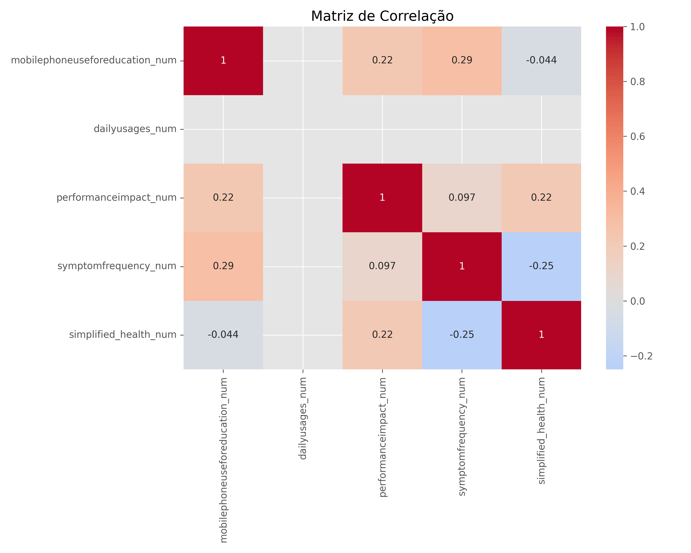

# 📊 Impacto do Uso de Celulares na Educação e Saúde

Este projeto analisa dados reais coletados de estudantes sobre o uso de **telefones celulares**, seus impactos na **educação**, na **saúde mental/física** e na **atenção durante os estudos**. Os resultados são apresentados de forma interativa e visual para facilitar a tomada de decisão em contextos educacionais.

---

## 🌐 Visualização Interativa

Explore as análises em tempo real no ambiente Posit Cloud:

👉 **[Abrir Dashboard no Posit Cloud 🚀](https://connect.posit.cloud/paulocesar/content/new?tab=example)**

---

## 📥 Baixar Dados em CSV

Você pode baixar os dados tratados e prontos para análise clicando no botão abaixo:

[⬇️ Download CSV - Dados Limpos](./data/dados_uso_celular_limpos.csv)

---

## 📸 Visualização de Correlação



---

## 🗂️ Estrutura do Projeto

```
saudecelular/
├── app/                      → Apps com Shiny e Plotly
├── data/                     → Dados originais e tratados
├── scripts/                  → Scripts de análise estatística
├── plots/                    → Gráficos gerados (matplotlib/seaborn)
├── README.md                 → Descrição do projeto
├── index.md                  → Página para GitHub Pages
├── _config.yml               → Tema automático do GitHub Pages
```

---

## 🔧 Tecnologias Utilizadas

- Python 3.13
- Pandas, NumPy
- Plotly, Seaborn, Matplotlib
- Shiny para Python
- ShinyWidgets
- GitHub Pages + Posit Cloud

---

## 📎 Fonte dos Dados

- [Kaggle - Students Health and Academic Performance](https://www.kaggle.com/datasets/innocentmfa/students-health-and-academic-performance/data)
- Coletados via Google Forms conforme descrição do autor

---

## 👨‍💻 Autor

**Paulo Rebelo**  
[GitHub](https://github.com/Rebelo81) | [LinkedIn](https://linkedin.com/in/paulorebelo)